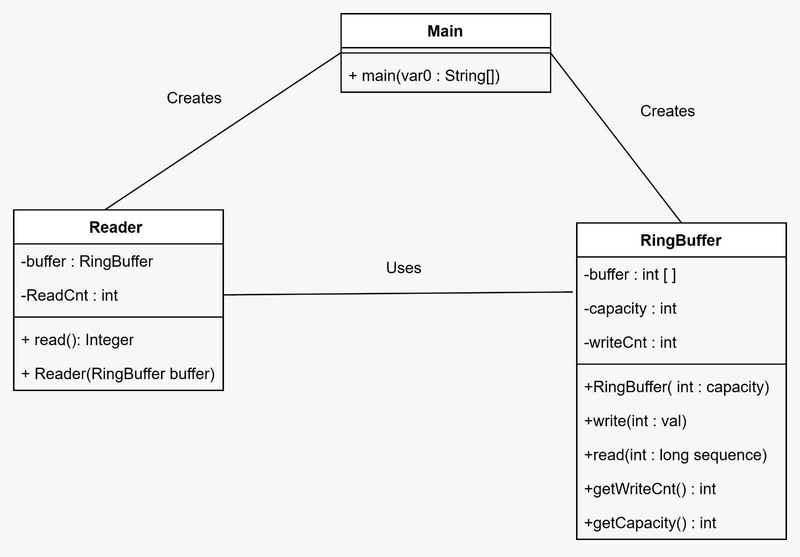
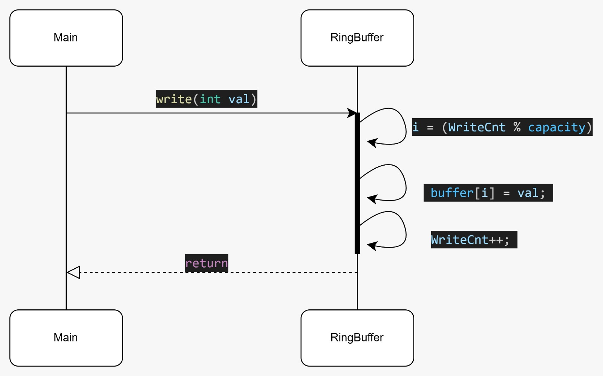
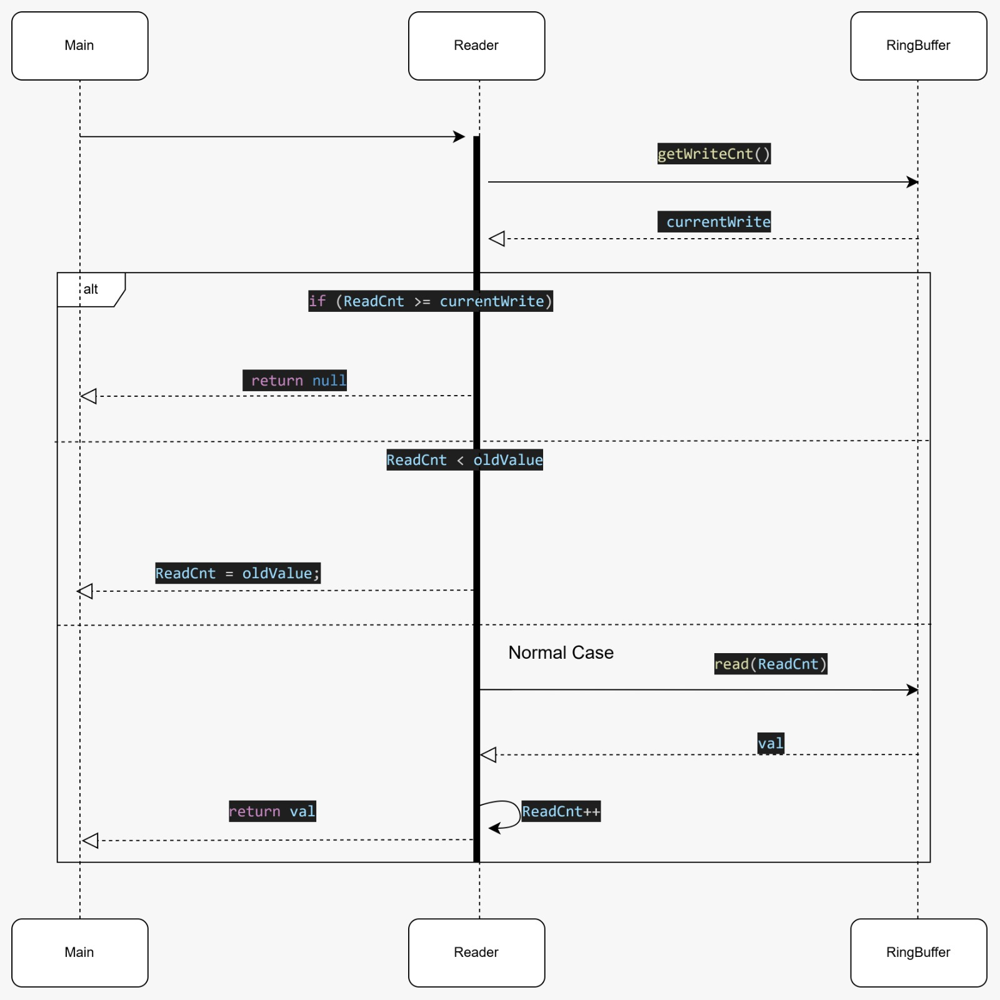

# RingBuffer 

## Project Overview

This project implements a **fixed-size ring buffer** in Java with:
- **Single Writer**
- **Multiple Readers**
- Each reader reads **independently** (one reader does not affect others)
- When the buffer is full, the writer **overwrites the oldest data**
- Slow readers may **miss items** (they automatically catch up)

Each `Reader` keeps its own read position (`ReadCnt`). The buffer uses a counter (`WriteCnt`) to map each write/read to a physical array index via %:
- `index = sequence % capacity`

## How It Works 
The ring buffer stores values in a fixed array.  
Instead of tracking “head” and “tail” pointers, we use **sequence numbers**:

- Writer increments `WriteCnt` after every write.
- Each reader increments its own `ReadCnt` after every read.
- The real array index is always `sequence % capacity`.

## Responsibilities

### `RingBuffer`
**Responsibility:** store data and support sequential writes/reads.
- Holds the internal array `int[] buffer`
- Holds `capacity`
- Holds  write sequence `WriteCnt`
- `write()` writes to `buffer[WriteCnt % capacity]` and increments `WriteCnt`
- `read()` returns `buffer[sequence % capacity]`

### `Reader`
**Responsibility:** read from the ring buffer independently from other readers.
- Stores its own read sequence `ReadCnt`
- Has a reference to the shared `RingBuffer`
- Logic in `read()`:
  1. `currentWrite = buffer.getWriteCnt()`
  2. `oldestAvailable = max(0, currentWrite - buffer.getCapacity())`
  3. If the reader is too slow (`ReadCnt < oldestAvailable`) → it **skips missed items** by setting `ReadCnt = oldestAvailable`
  4. If there is no new data (`ReadCnt >= currentWrite`) → return `null`
  5. Otherwise:
     - `val = buffer.read(ReadCnt)`
     - `ReadCnt++`
     - return `val`

### `Main`
**Responsibility:** demo runner.
- Creates the buffer and readers
- Writes values and prints results from multiple readers

---

## UML Diagrams

### UML Class Diagram

### UML Sequence Diagram — `write(int val)`

### UML Sequence Diagram — `read()`

---

## How to Run / Test

The program needs to be run from the main.java 
