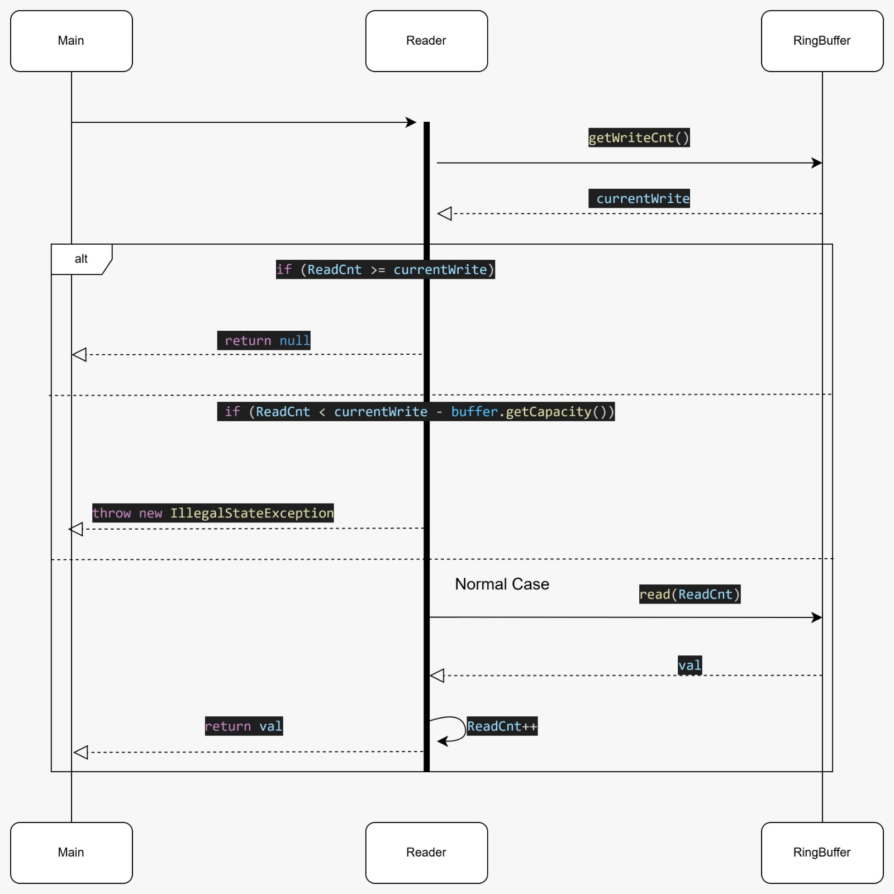

# RingBuffer 

## Project Overview

This project implements a **fixed-size ring buffer** in Java with:
- **one writer**
- **multiple independent readers** 

Each `Reader` keeps its own read position (`ReadCnt`). The buffer uses a counter (`WriteCnt`) to map each write/read to a physical array index via %:
- `index = sequence % capacity`

The implementation also detects two important exceptions:
1. **No new data** → `Reader.read()` returns `null`
2. **Reader is too slow and data was overwritten** → `Reader.read()` throws `IllegalStateException`

## Responsibilities

### `RingBuffer`
**Responsibility:** store data and support sequential writes/reads.
- Holds the internal array `int[] buffer`
- Holds `capacity`
- Holds global write sequence `WriteCnt`
- `write(int val)` writes to `buffer[WriteCnt % capacity]` and increments `WriteCnt`
- `read(long sequence)` returns `buffer[sequence % capacity]`

Key idea: the array index is derived from the **sequence number**, not from a moving head/tail pointer.

### `Reader`
**Responsibility:** read from the ring buffer independently from other readers.
- Stores its own read sequence `ReadCnt`
- Has a reference to the shared `RingBuffer`
- Logic in `read()`:
  1. `currentWrite = buffer.getWriteCnt()`
  2. If `ReadCnt >= currentWrite` → return `null` (no new data)
  3. If `ReadCnt < currentWrite - buffer.getCapacity()` → throw `IllegalStateException` (data overwritten)
  4. Otherwise read `val = buffer.read(ReadCnt)`, then `ReadCnt++`

### `Main`
**Responsibility:** demo runner.
- Creates the buffer and readers
- Writes values and prints results from multiple readers

---

## UML Diagrams

### UML Class Diagram

### UML Sequence Diagram — `write(int val)`

### UML Sequence Diagram — `read()`

---

## How to Run / Test
